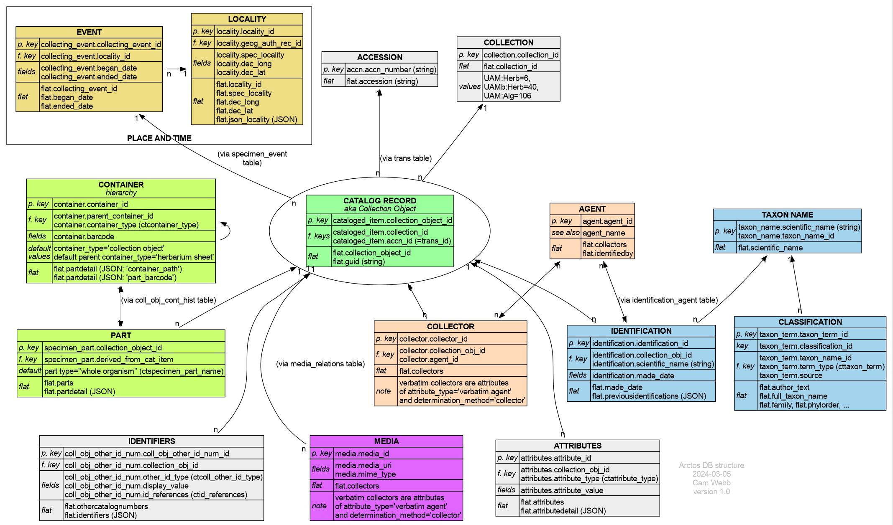

# The Arctos data model

This is an overview of the Arctos data model, with key tables, and how
some of the key data elements appear in the `flat` table. It is not a
full ER diagram, more a map of the territory. The diagram is also
available as a [PDF][1] with clickable links to the relevant table
documentation in Arctos.

(The diagram was made with [GraphViz][2];
[source](img/data_model.dot))

[1]: https://github.com/ALA-herbarium/documentation/raw/main/img/data_model.pdf
[2]: https://www.graphviz.org/
