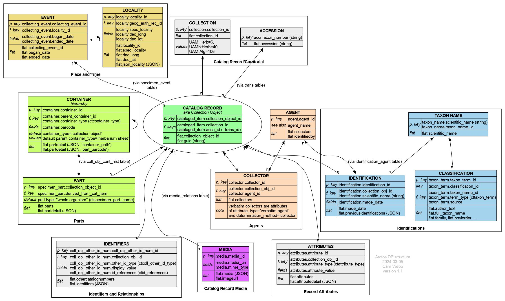

# The Arctos data model

This is an overview of the Arctos data model, with key tables, and how
some of the key data elements appear in the `flat` table. It is not a
full ER diagram, more a map of the territory. The diagram is also
available as a [PDF](img/data_model.pdf) with clickable links to the
relevant table documentation in Arctos.

(The diagram was made with [GraphViz](https://www.graphviz.org/);
[source](img/data_model.dot))
