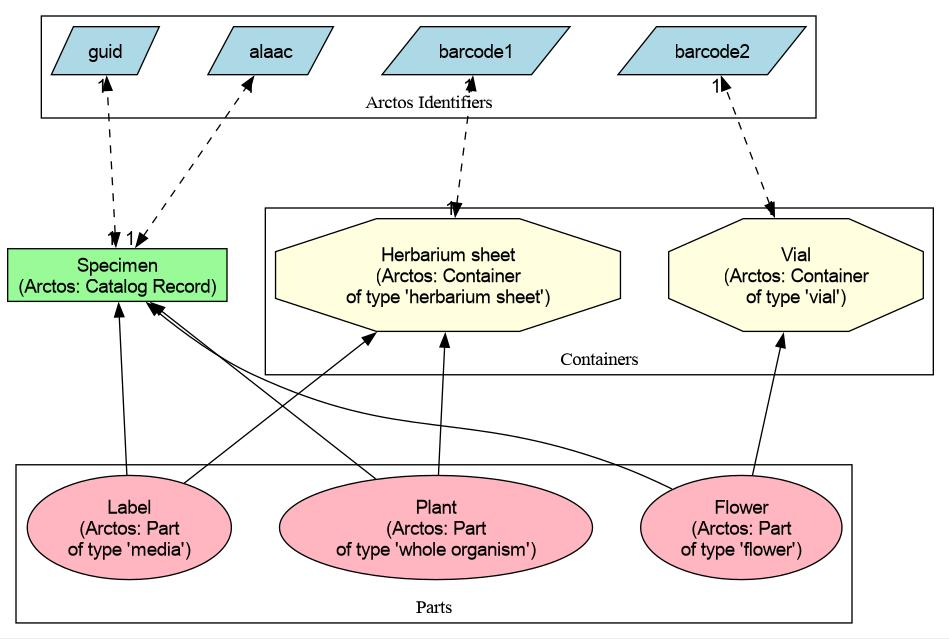

# The data model

## The Arctos data model

This is an overview of the Arctos data model, with key tables, and how
some of the key data elements appear in the `flat` table. It is not a
full ER diagram, more a map of the territory. The diagram is also
available as a [PDF][1] with clickable links to the relevant table
documentation in Arctos.

Key:

 * _outline boxes_: represent the panels within the Arctos catalog
   record page
 * _colored tables_: primary tables in the Arctos DB
 * _p. key_: primary key in the main, original data table
 * _f. key(s)_: foreign keys in the original data table
 * _fields_: other primary fields in the original data table
 * _flat_: the fields in `flat` which represent data from the original table
 * Edges:
    * n ➡ 1: multiple records of the first table relate to a single
      record in the target table
    * n ↔ n: multiple records of the first table relate to multiple
      record in the target table
    * 1 ↔ 1: a single record of the first table relates to a single
      record in the target table

The diagram was made with [GraphViz][2]. [Source](img/data_model.dot).

## Mapping ALA physical objects to Arctos data model

(In the following, **Arctos concepts** are in bold type, _physical
objects_ or concepts are in italic type, and `identifiers` are in
monospaced type)

 * SPECIMENS
    * The physical unit that is represented by the Arctos **Catalog Record**
      is the _Specimen_ (aka _Collection_). 
    * Each _specimen_ has a unique `ALAAC` (ALA accession number), so
      there should be a one-to-one mapping of Arctos `GUID` to
      `ALAAC`.  Note: rarely, ALA stores duplicates of the same
      physical collection, which have the same collector number, the
      same ALAAC, and should be represented by the same Arctos record
      (i.e. same GUID); these duplicates will however have different
      barcodes.
 * PARTS  
    * Each _Specimen_ may contain one or more elements of several
      kinds:
       * a whole organism (common for herbs), or 
       * a part of an organism (leaf, twig, flower, e.g., from a tree), or 
       * a paper label.
    * These physical _elements_ are represented in Arctos as
      **Parts**.
    * Each **Part** is of a type, controlled by the
      [ctspecimen_part_name][3] code table.
    * At a minimum, every Arctos **Record** has one **Part**, of
      default type **whole organism**.
    * In reality, there may be several _whole organisms_ in a
      _collection_ (common for small, alpine plants). These may be
      modeled as separate **Parts** in Arctos if it is useful, but
      usually are represented as a single **Part** of type **whole
      organism**.
    * Cases where it is useful to indicate separate _elements_ as
      additional **Parts** (see [this][4] _specimen_ for a full set of
      _elements_)
       * A part of an organism, e.g., a _leaf_ (**Part** type:
         **leaf**) has been sent for destructive sequencing,
       * A part of an organism, e.g., a _flower_ (**Part** type:
         **flower**) exists in an alcohol collection.
       * A DNA sample exists separate from the specimen, in a
         local or external lab (**Part** type: **DNA**).
       * A physically large plant is cut up and pasted to several
         _herbarium sheets_ (**Part** types: **whole organism** and/or
         **leaf**)
       * An exact duplicate of a collection (i.e., all data the same,
         but two or more physical sheets).
       * There is an _annotation label_ on the _herbarium sheet_, other
         than a ‘det slip’ (which are recorded in Arctos as additional
         **Identifications**). This is represented as a **Part** of
         type **media**.
 * CONTAINERS
    * Physically, all _elements_ of a collection exist somewhere,
      usually attached to a single _herbarium sheet_.
    * Arctos models this by allowing each **Part** to be contained in
      a **Container**. Usually a **whole organism** occurs in/on
      a **Container** of type **herbarium sheet**.
    * Each **Container** may have a `barcode`, but **Parts** do no
      themselves have barcodes.
    * Different **Parts** of one **Catalog record** may exist in
      different **Containers**
    * NOTE: In rare cases, a single **Container** may contain **Parts** 
      from different **Records**. For example, rarely two
      _individuals_ of different species were attached to the same _herbarium
      sheet_ (and so cannot be called a single _specimen_). They should be 
      assigned to different **Records** with different `GUID` and `ALAAC`,
      even though the collector and event info is the same. Each of 
      the **Records** will have **Parts** that share the same **herbarium 
      sheet** **Container** (and `barcode`) with the other **Record**.
    * **Containers** themselves can be housed hierarchically in 
      other **Containers** which each have barcodes and descriptions.
      This permits _herbarium sheets_ to be found:
      cabinet > shelf > folder > sheet.
    * To enter data for a large specimen than has been split up and
      attached to several _herbarium_ sheets, a single **Catalog
      Record** with a single `ALAAC` should have several **Parts**,
      with each of these **Parts** housed in a different **Container**
      of type **herbarium sheet**, each with a different `barcode`.
    * A _wet collection_ of a _flower_ should be a separate **Part**
      of a **Record**, with type **flower**, and contained in a
      **Container** of type **vial**.

### Identifiers

Using the above model, the following should be true:

 1. Each `GUID` should have a single `ALAAC` (note: unique ALAACs are
    not enforced by Arctos)
 2. Rarely, each `GUID` and `ALAAC` may have one or more `barcodes`
 3. Rarely, a single `barcode` may be associated with more than one
   `GUID` and `ALAAC`

Anny cases of multiple ALAAC for a single GUID should be investigated
and duplicate records deleted. Because cases (2) and (3) above are
rare, they should be checked manually.

[1]: https://github.com/ALA-herbarium/documentation/raw/main/img/data_model.pdf
[2]: https://www.graphviz.org/
[3]: https://arctos.database.museum/info/ctDocumentation.cfm?table=ctspecimen_part_name
[4]: https://arctos.database.museum/guid/UAM:Herb:40073
