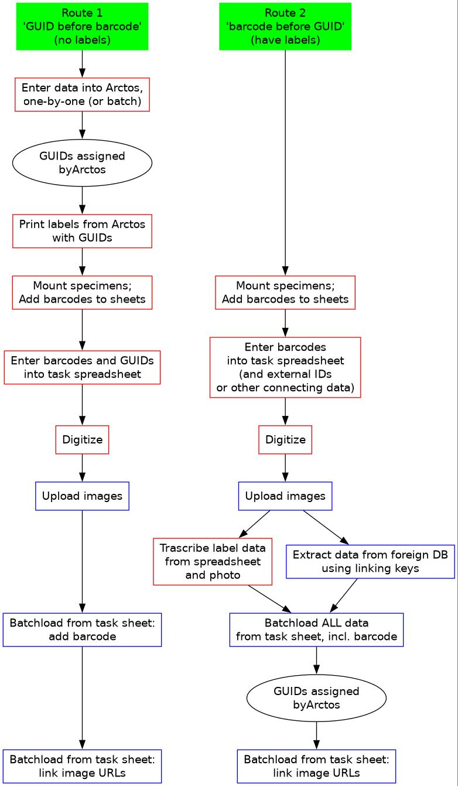

# Processing steps

 * In herbarium:
    * Assess new accessions (numbers, source, data availability)
    * Pick accession number (and record ALAAC series)
    * Premounting (stamp ALAAC and stick barcode)
    * Enter data in spreadsheet (Barcode and ALAAC and any specimen
      identifiers, PLUS, if no specimen identifiers, also record taxon, date,
      collectors)
    * Mounting
    * Imaging
    * (Filing)
    * (Into Range)
 * Data
    * Upload images (register TACC directory in list)
    * Obtain metadata from specimen source
    * Make transcription spreadsheet (if not all data can be imported)
    * Transcribe
    * Collate all data, and create Arctos batch data enty file
    * Batch load metadata 
    * Batch associate images
    * Double-check (download Arctos data for the accession and check for
      errors)

## Poster

It would be great to make a big, laminated poster to stick on the wall
with the steps in a sort-of flow chart diagram. We can make a small
card for each set of specimens and stick it to the poster, moving it
downward as each step is completed. 

What will be most efficient is that all specimens in an accession
finish each step before moving forward.
