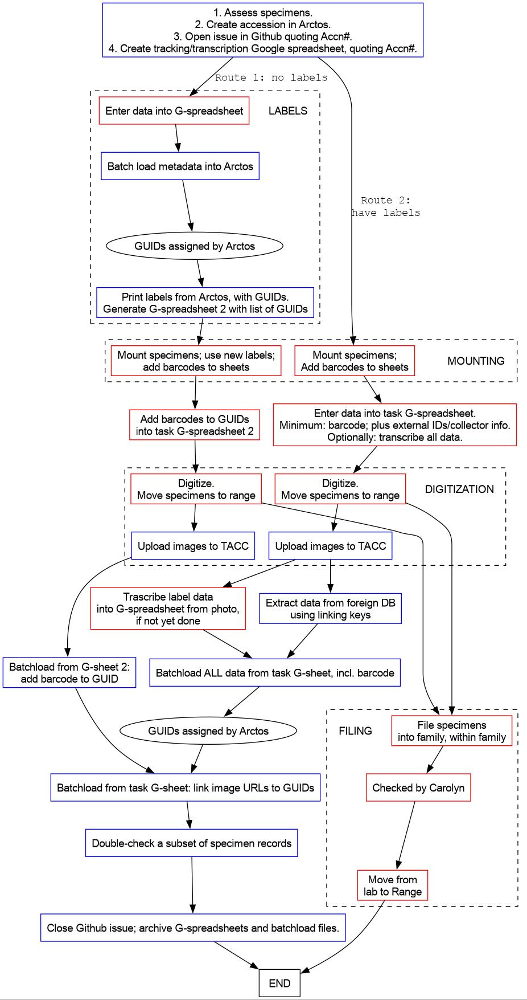

# Processing steps

(blue boxes: Steffi or Cam; red boxes: herbarium assistants)

## Poster

It would be great to make a big, laminated poster to stick on the wall
with the steps in a sort-of flow chart diagram. We can make a small
card for each set of specimens and stick it to the poster, moving it
downward as each step is completed. 

What will be most efficient is that all specimens in an accession
finish each step before moving forward.
